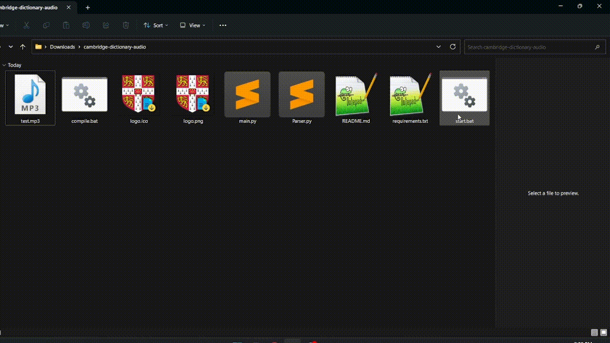

# cambridge-dictionary-audio 

This is a python program which may scrape <b>audio files</b> of word pronunciations from the <a href="http://dictionary.cambridge.org">dictionary.cambridge.org</a>



## Quick start▶️

You can just download .exe file:

https://github.com/astrosander/cambridge-dictionary-audio/releases/tag/cambridge-dictionary

Or install with python:

## Python Installation 

Download or clone this GitHub repository
install requirements with:

```sh
pip3 install -r requirements.txt
```

## Start cambridge-dictionary-audio ▶️

Run main.py

```sh
open start.bat
```

After launching, you will need to enter a word or phrase and then wait about 1-2 seconds. Once downloaded, the .mp3 file will appear in the folder and the sound will play automatically.

##  Plans for future📜
<ul>
  <li>Add a display of transcriptions and translations  </li>
  <li>Make add-on in Anki  </li>
  <li>Reduce delay time⏳</li>
</ul>
